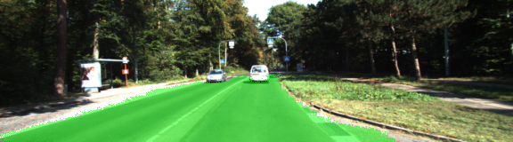
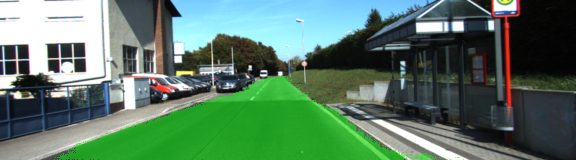
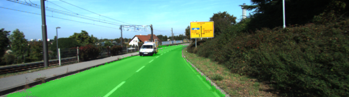
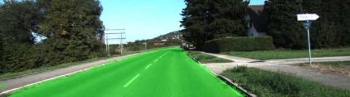
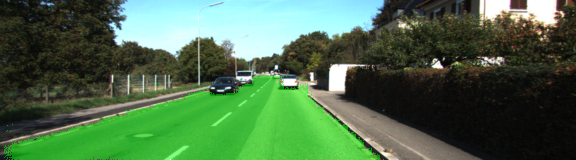
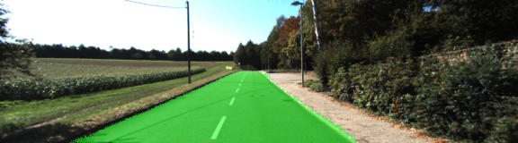

#Semantic Segmentation Project

This is a project from Udacity Self-driving car nanodegree. The goal of the project is using a fully convolutional neural network for semantic segmentation that segment the drivable road area.

###results
after 70 epochs(half hour time in total using GTX1080ti) traning the loss is lower than 0.03. here are some sample images from the output folder:

###Architecture
Using a pre trained VGG model to be a encoder. Then converting the fully connected layer to a 1x1 convolution layer. finally add the upsample layers as the decoder to upsample the features that vgg have just extracted to the mask of the input image. the full model is defined in function 'layers()'

###hyperparameters
keep probability: 0.5
learning rate: 0.0001
epochs: 70
batch_size: 5